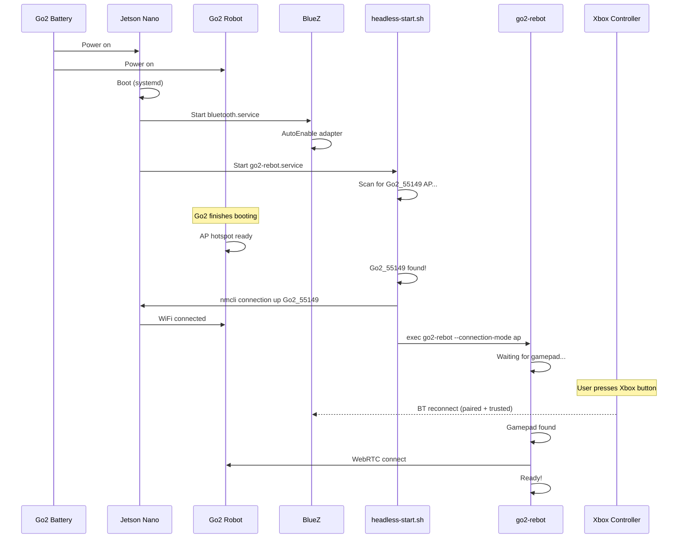

# Go2 ReBot

Xbox Wireless Controller bridge for the Unitree Go2 robot dog. Runs headlessly on a Jetson Nano (Orin) powered by the Go2's battery.

## System Overview

```
Xbox Controller (BT) --> Jetson Nano --> Go2 Robot (WebRTC)
```

**Hardware:**
- Jetson Nano (Orin), Ubuntu 22.04, powered by Go2 battery
- Xbox Wireless Controller, paired via Bluetooth (BlueZ 5.64)
- Unitree Go2 robot dog

**Software:**
- `go2-rebot` -- main service (Python, evdev)
- `go2-driver` -- Go2 WebRTC communication library
- systemd service for headless boot

---

## Xbox Controller Mapping

### Sticks and Movement

| Xbox Input     | Go2 Action          |
|----------------|---------------------|
| Left stick     | Walk / strafe       |
| Right stick    | Yaw / look          |

Speed is capped at 50% by default (`--speed-limit 0.5`).

### Button Actions

| Xbox Input          | Go2 Action                          |
|---------------------|-------------------------------------|
| Start               | Walking mode                        |
| Select              | Standing mode                       |
| LT + A              | Lock posture (stand/crouch toggle)  |
| LT + B              | Damp (motors off)                   |
| LT + X              | Stand up from fall                  |
| LT + Select         | Searchlight toggle                  |
| RT + A              | Stretch                             |
| RT + B              | Shake hands                         |
| RT + Y              | Love                                |
| RB + X              | Pounce                              |
| RB + A              | Jump forward                        |
| RB + B              | Sit down                            |
| LB + A              | Greet                               |
| LB + B              | Dance                               |
| D-Right + Start     | Stair mode 1 (fwd up / bwd down)    |
| D-Left + Select     | Stair mode 2 (fwd down)             |
| LB + Select         | Endurance mode                      |
| L-stick click       | F1 (spare)                          |
| R-stick click       | F2 (spare)                          |

### Safety Blocklist

These combos are **blocked by default** (use `--allow-all` to enable with countdown):

| Combo        | Action                              |
|--------------|-------------------------------------|
| LT + B       | Damp -- motors off, robot collapses |
| RB + A       | Jump forward                        |
| RB + X       | Pounce                              |

With `--allow-all`, blocked combos require a 3-vibration hold countdown before sending.

### Emergency Stop

Hold **LB + LT + RB + RT + any face button** (A/B/X/Y) through a 3-vibration countdown to send Damp (all motors off). Always active regardless of `--allow-all`.

---

## Running

### STA mode (your home WiFi)

Full control over your home WiFi network. Requires the Go2's IP.

```bash
go2-rebot --connection-mode sta --ip 192.168.1.133
```

### AP mode (Go2 hotspot)

Full control over the Go2's own WiFi hotspot. No external network needed.

```bash
nmcli connection up Go2_55149
go2-rebot --connection-mode ap
```

### Common Options

| Flag                      | Description                              |
|---------------------------|------------------------------------------|
| `--dry-run`               | Show actions without connecting to robot|
| `--wait-for-gamepad N`    | Wait N seconds for controller (0=forever)|
| `--speed-limit 0.5`       | Cap joystick output (0.0-1.0)            |
| `--allow-all`             | Allow dangerous combos with countdown    |

---

## Headless Boot System

The system runs automatically on boot without a monitor, keyboard, or mouse.

### systemd Service

The `go2-rebot.service` runs `headless-start.sh` on boot as user `goofy-go2`. It starts after Bluetooth and NetworkManager are ready.

- **Auto-restart:** If the process crashes (gamepad disconnect, Go2 unreachable), systemd restarts it after 10 seconds.
- **Logs:** `journalctl -u go2-rebot -f`

### Boot Sequence



### WiFi Logic

The `headless-start.sh` wrapper:

1. **Scans** for `Go2_55149` AP for up to 2 minutes
2. **If found:** Switches WiFi to Go2 AP, runs `go2-rebot` in AP mode
3. **If not found:** Exits (systemd restarts after 10s)

This means the service waits for the Go2 to power up and start its hotspot before connecting.

### Bluetooth Auto-Reconnect

The Xbox Wireless Controller is pre-configured:
- **Paired:** yes
- **Trusted:** yes
- **WakeAllowed:** yes
- **BlueZ AutoEnable:** true

On boot, the Bluetooth adapter powers on automatically. When the user presses the Xbox button, BlueZ reconnects without any interaction needed.

### Recovery

| Scenario                    | What happens                                    |
|-----------------------------|-------------------------------------------------|
| Xbox controller disconnects | Process exits, systemd restarts, waits for reconnect |
| Go2 AP never appears        | Service exits, systemd restarts to retry        |
| Go2 WebRTC fails            | Process exits, systemd restarts, retries        |
| Service crashes repeatedly  | systemd rate-limits restarts (5 in 10s = stop)  |

---

## Service Management

```bash
# Install the service (enable on boot)
./install-service.sh --install

# Uninstall
./install-service.sh --uninstall

# Check status
./install-service.sh --status

# Manual control
sudo systemctl start go2-rebot
sudo systemctl stop go2-rebot
sudo systemctl restart go2-rebot
sudo systemctl status go2-rebot

# View logs
journalctl -u go2-rebot -f

# Quick stop
./stop.sh
```

---

## File Layout

```
go2-rebot/
  src/go2_rebot/
    __init__.py
    cli.py                 # Main service (gamepad → Go2 send loop)
  go2-rebot.service        # systemd unit file
  headless-start.sh        # Boot wrapper (WiFi scan + launch)
  install-service.sh       # Service install/uninstall helper
  start.sh                 # Manual start (activates venv)
  stop.sh                  # Quick stop (systemctl stop)
  pyproject.toml           # Package metadata and dependencies
  docs/
    README.md              # This file
```

---

## Prerequisites

User `goofy-go2` must be in the `input` group for evdev gamepad access:

```bash
sudo usermod -aG input goofy-go2
# Log out and back in for changes to take effect
```
